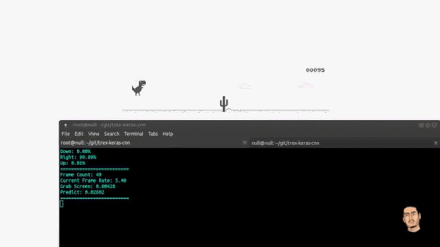
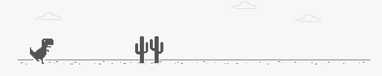

# T-Rex Keras CNN

<p align="center">
  <a href="https://www.youtube.com/watch?v=oTCmk94YMvU" target="_BLANK">
    
  </a>
</p>


## T-rex game
[http://www.trex-game.skipser.com](http://www.trex-game.skipser.com)


### Install Requirement
```
pip install -r requirements.txt
```

Recommended to use Tensorflow-GPU as backend

## Instruction

### 1. Collect Data

- Edit screen capture config in [collect_data.py](https://github.com/kittinan/trex-keras-cnn/blob/e349a721be7031075edf800bf581ddde2369929f/collect_data.py#L9) Line 9

- run [collect_data.py](https://github.com/kittinan/trex-keras-cnn/blob/master/collect_data.py) as root (require root by keybaord package)

This game use 3 keys on keyboard to record screen capture, the screen capture image will store in ./img/ folder. The image capture resolution is 650x130 pixel

| Key              | Description                 |
| ---------------- | --------------------------- |
| Up Arrow (↑)     | T-Rex Jump                  |
| Down Arrow (↓)   | T-Rex Crouch                |
| Right Arrow (→)  | T-Rex ran normal            |

if you want to exit collect_data.py press **esc** key.

Please check your screen capture correction in the folder ./img/  before go to next step

*Example image captured*
<p align="center">
  
</p>


### 2. Training

Just run [train.py](https://github.com/kittinan/trex-keras-cnn/blob/master/train.py)

```bash
python train.py
```

train until 98%+ accuracy. the weight file trex_weight.h5 will create.


### 3. Play your model

run [player.py](https://github.com/kittinan/trex-keras-cnn/blob/master/player.py) as root (require root by keybaord package)

```bash
python player.py
```

It possible T-Rex will jump before barrier, you can modify delay in [player.py](https://github.com/kittinan/trex-keras-cnn/blob/f270752de93caefc45182eb270163b78c0093972/player.py#L43)

## Dataset & Pretrained Model

Available soon

## Contributing
Feel free to contribute on this project, I will be happy to work with you.

## License
The MIT License (MIT)
