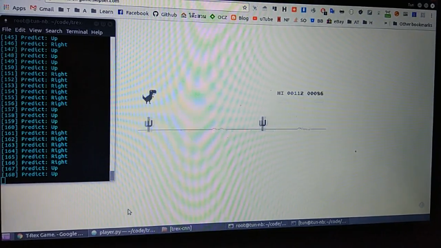

# T-Rex Keras CNN

<p align="center">
  <a href="https://www.youtube.com/watch?v=oTCmk94YMvU" target="_BLANK">
    
  </a>
</p>


## T-rex game
[http://www.trex-game.skipser.com](http://www.trex-game.skipser.com)


### Install Requirement
```
pip install -r requirements.txt
```

Recommended to use Tensorflow-GPU as backend

## Instruction

### 1. Collect Data

- Edit screen capture config in [collect_data.py](https://github.com/kittinan/trex-keras-cnn/blob/e349a721be7031075edf800bf581ddde2369929f/collect_data.py#L9) Line 9

- run [collect_data.py](https://github.com/kittinan/trex-keras-cnn/blob/master/collect_data.py) as root

This game is use 3 keys on keyboard to record screen capture, the screen capture image will store in ./img/ folder

| Key              | Description                 |
| ---------------- | --------------------------- |
| Up Arrow (↑)     | T-Rex Jump                  |
| Down Arrow (↓)   | T-Rex Crouch                |
| Right Arrow (→)  | T-Rex ran normal            |
